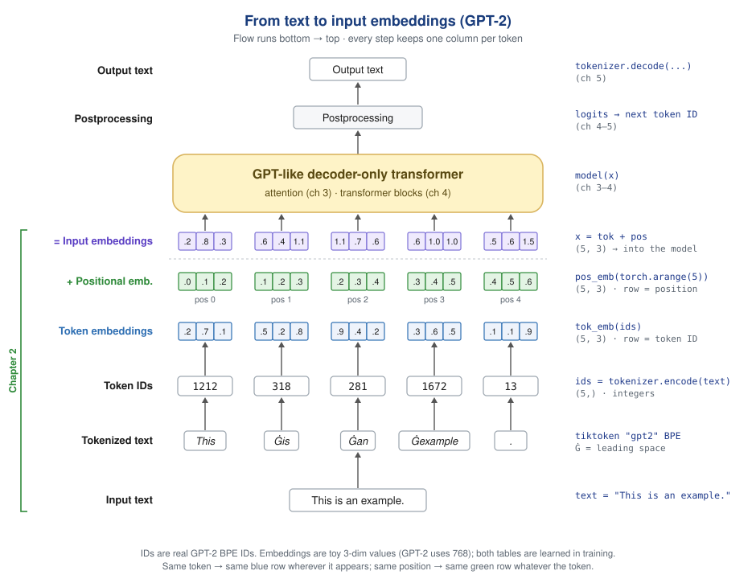

# Chapter 2 notes

## The input-prep pipeline (chapter overview)

Everything in this chapter is one leg of this chain:

`Input text → Tokenized text → Token IDs → Token embeddings → (GPT-like transformer)`

- **Tokenize** — `simple_tokenizer_demo.py` (from-scratch word-level) and the BPE step in `bpe_pipeline.py`.
- **IDs → training batches** — `gpt_dataset.py` slices the IDs into `(input, target)` windows (see below).
- **IDs → embeddings** — `bpe_pipeline.py`, the final token + positional embedding step.

The token-IDs → embeddings step is a lookup table; *why* that lookup is really a
matrix multiply (and how it scales to a whole sentence at once) is drawn in
[`../../one_hot_lookup.svg`](../../one_hot_lookup.svg).

## Sliding window: `max_length` vs `stride`

Two separate knobs in `GPTDatasetV1`:

- **`max_length`** = **width** of each training example (the context window, 4 in the figure).
- **`stride`** = **spacing** — how far the window jumps to start the next example (`i += stride` in the loop).

They're decoupled on purpose: you can want 4-token examples but independently
choose whether consecutive ones start 1 or 4 tokens apart.

### What stride controls: overlap

- `stride == max_length` → windows tile side-by-side, every token used once, fewest samples. Common default (the
  figure's case).
- `stride < max_length` → windows overlap, so the same text yields more examples and each token appears in several
  positions/contexts. Good for small datasets, but the redundancy raises overfitting risk.
- `stride > max_length` → skips tokens, throwing away data — rarely wanted.

### The key correction: two senses of "seeing" a token

Easy to conflate, but distinct:

1. **Within one example** — causal attention: a token looks back only at earlier
   tokens *inside its own chunk*. In `i=2`, `["heart","of","the","city"]` does
   **not** see `"In"`/`"the"` from the text's start — they aren't in the window.
2. **Across the dataset** — every token still contributes as training signal
   because the chunks tile the text (nothing skipped when stride ≤ max_length).
   `"In"`/`"the"` did their job back in `i=0`.

### Why it matters

The context window is finite — that's literally what `max_length` is. A
dependency spanning more than `max_length` tokens can't be connected within a
single example; bigger context windows exist to reduce how often that bites.
Stride doesn't fix this, but overlap lets a word appear in multiple windows with
different neighbors.
