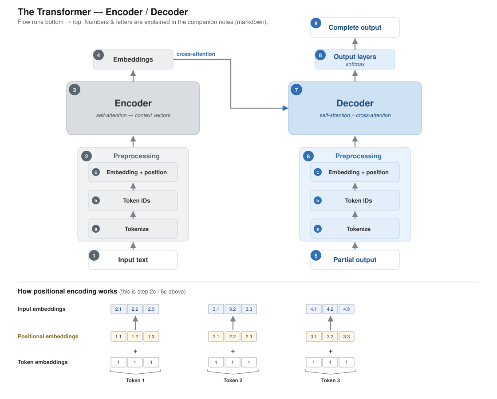

# The Transformer — Encoder / Decoder (companion notes)

These notes go with the diagram below. The diagram carries the picture; this file carries the words. Numbers (1–9) and letters (a/b/c) below match the labels on the diagram. Flow runs **bottom → top**: encoder on the left, decoder on the right.



---

## Key

**1. Input text** — the full source sentence to be translated, e.g. *"This is an example."*

**2. Preprocessing (encoder)** — turns raw text into vectors the model can work with. It has three inner steps (a → b → c), described in the next section.

**3. Encoder** — reads **all tokens at once** (parallel, not word-by-word) and makes each embedding *context-aware* via self-attention. The only loop here is over the stacked layers, not over words:

```python
x = embed(tokens) + positional_info
for layer in encoder_layers:   # e.g. 6–12 blocks
    x = layer(x)               # self-attention + feed-forward
return x                       # context-rich embeddings
```

**4. Embeddings** — the encoder's context-rich output vectors, handed to the decoder (the arrow crossing to box 7). See *cross-attention* below for how the handoff actually works.

**5. Partial output** — the translation produced so far, e.g. *"Das ist ein."*

**6. Preprocessing (decoder)** — the same three inner steps as box 2, applied to the partial output.

**7. Decoder** — combines the encoder's embeddings (box 4) with the partial output to predict the next token; runs **one token at a time** (autoregressive).

**8. Output layers** — a final linear layer + **softmax** → a probability over the whole vocabulary; the highest-probability token is picked (*"Beispiel"*).

**9. Complete output** — the loop repeats, appending each new token, until the end-of-sequence token (`<|endoftext|>`). Result: *"Das ist ein Beispiel."*

---

## Preprocessing, step by step (the inner boxes)

Preprocessing is where raw text becomes numbers. The diagram splits it into three inner boxes, bottom to top:

### a. Tokenize
Split the text into tokens. GPT uses **Byte Pair Encoding (BPE)** — subword chunks rather than whole words. Common words stay whole; rare words break into known pieces, so *any* word can be represented and nothing is thrown away.

```python
tokenizer = tiktoken.get_encoding("gpt2")
ids = tokenizer.encode(text)   # subword IDs, no <|unk|>
```

(Contrast with the book's hand-built `SimpleTokenizerV2`, a plain **word-level** tokenizer backed by a Python dictionary — anything unseen collapses to a single `<|unk|>`. BPE exists precisely to avoid that.)

### b. Convert to dictionary integer IDs
Each token is looked up in the vocabulary and replaced by its **integer ID** — a simple dictionary lookup (`str → int`). At this point the sentence is just a list of integers.

### c. Embedding + positional encoding
Two things happen here:

- **Embedding.** The *embedding model* converts raw input (a token ID) into a **vector representation**. Mechanically it's a learnable lookup table of shape `(vocab_size × embedding_dim)`: token ID 42 → grab row 42 → that's its vector. The numbers start random and are **learned during training** — exactly like the weights in your MNIST network — so tokens used in similar contexts end up with similar vectors.
- **Positional encoding.** A position vector is *added* to each token embedding (see next section).

---

## Positional encoding — how it's done

**The problem:** self-attention treats its input as a *set*, not a *sequence* — on its own it has no idea which token came first. Without position information, *"dog bites man"* and *"man bites dog"* would look identical to the model.

**The fix:** give every **position** its own vector (a *positional embedding*), and simply **add** it, element-by-element, to the token embedding at that position. The sum is the *input embedding* that actually enters the encoder/decoder:

```
input embedding[i] = token embedding[i] + positional embedding[i]
```

This is exactly what the diagram panel shows. Using the panel's toy numbers (token embeddings are all `1` just to keep it readable):

| Position | Token embedding | Positional embedding | Input embedding (sum) |
|----------|-----------------|----------------------|------------------------|
| Token 1  | `1, 1, 1`       | `1.1, 1.2, 1.3`      | `2.1, 2.2, 2.3`        |
| Token 2  | `1, 1, 1`       | `2.1, 2.2, 2.3`      | `3.1, 3.2, 3.3`        |
| Token 3  | `1, 1, 1`       | `3.1, 3.2, 3.3`      | `4.1, 4.2, 4.3`        |

The same token in two different positions now enters the model as two different vectors — that difference is what encodes word order.

**Two flavours you'll meet:**
- *Fixed / sinusoidal* — the original 2017 transformer computes each position vector from sine and cosine functions. Nothing to learn; works for any length.
- *Learned* — GPT-2 (and the book) instead make the positional embeddings a **learnable** table, trained just like the token embeddings. That's the version implied by the code line `embed(tokens) + positional_info`.

---

## Zoom in: the mechanisms

### Self-attention → context vectors (inside box 3)
How a plain embedding becomes context-aware. Each token compares itself against every other token, gets a relevance weight for each, then takes a weighted sum of their information. The output is a **context vector**: *"bank"* beside *"river"* ends up different from *"bank"* beside *"money."* Every token does this at once — the encoder's parallelism.

### Softmax (inside box 8)
The output layer emits one raw score (a **logit**) per vocabulary token. Softmax squashes those scores into probabilities that sum to 1, so the largest is the model's pick — exactly your MNIST final layer, just with ~50,000 classes instead of 10.

### Encoder → Decoder: cross-attention (the 4 → 7 arrow)
The encoder's output (box 4) is **not copied** into the decoder — it is *attended to*. Every decoder block runs two attention steps:

1. **Self-attention** over the tokens generated so far ("what have I written?").
2. **Cross-attention**, where the decoder forms the *queries* and the encoder's output supplies the *keys* and *values* ("what in the source matters right now?").

So at each step the decoder re-reads the whole input sentence through cross-attention and blends it with what it has produced. That single arrow from 4 to 7 is this cross-attention link.

---

## Where each half became a real model family

- **BERT (encoder-only)** — trained by masking random words and filling them back in; sees the whole sentence both directions at once. Good for *understanding* (classification, search).
- **GPT (decoder-only)** — trained to predict the next word from left context only; generates text one token at a time (the loop in boxes 5–9). Good for *generating*.
