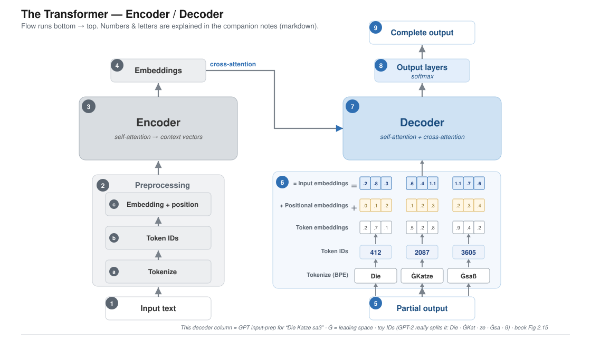
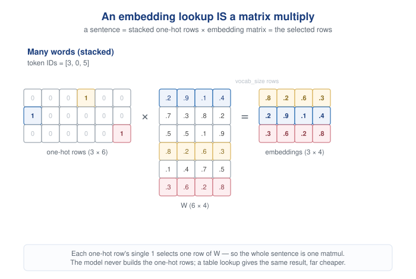

# The Transformer — Encoder / Decoder (companion notes)

[//]: # (![The Transformer — Encoder / Decoder]&#40;transformer_diagram_v3.svg&#41;)


- **Encoder (left)**: reads the English source, "The cat sat on the wall."
- **Decoder (right)**: reads and writes German only. Its input is the German it has produced so far, "Die Katze saß",
  which gets tokenized, turned into IDs and embedded exactly like box 6 shows, just with
  German tokens.
- **Cross-attention (the 4 → 7 arrow)**: this is the only place the two languages meet. The decoder looks at the
  encoder's English embeddings to decide which German token comes next. That link is the
  translation.

---

## Key

**1. Input text** — the full source sentence to be translated, e.g. *"The cat sat on the wall."*

**2. Preprocessing (encoder)** — turns raw text into vectors the model can work with. It has three inner steps (a → b →
c), described in the next section.

**3. Encoder** — reads **all tokens at once** (parallel, not word-by-word) and makes each embedding *context-aware* via
self-attention. The only loop here is over the stacked layers, not over words:

```python
x = embed(tokens) + positional_info
for layer in encoder_layers:  # e.g. 6–12 blocks
    x = layer(x)  # self-attention + feed-forward
return x  # context-rich embeddings
```

**4. Embeddings** — the encoder's context-rich output vectors, handed to the decoder (the arrow crossing to box 7). See
*cross-attention* below for how the handoff actually works.

**5. Partial output** — the translation produced so far, e.g. *"Das ist ein."*

**6. Preprocessing (decoder)** — the same three inner steps as box 2, applied to the partial output.

**7. Decoder** — combines the encoder's embeddings (box 4) with the partial output to predict the next token; runs **one
token at a time** (autoregressive).

**8. Output layers** — a final linear layer + **softmax** → a probability over the whole vocabulary; the
highest-probability token is picked (*"Beispiel"*).

**9. Complete output** — the loop repeats, appending each new token, until the end-of-sequence token (`<|endoftext|>`).
Result: *"Das ist ein Beispiel."*

---

## Preprocessing, step by step (the inner boxes)

Preprocessing is where raw text becomes numbers. The diagram splits it into three inner boxes, bottom to top:

### a. Tokenize

Split the text into tokens. GPT uses **Byte Pair Encoding (BPE)** — subword chunks rather than whole words. Common words
stay whole; rare words break into known pieces, so *any* word can be represented and nothing is thrown away.

```python
tokenizer = tiktoken.get_encoding("gpt2")
ids = tokenizer.encode(text)  # subword IDs, no <|unk|>
```

(Contrast with the book's hand-built `SimpleTokenizerV2`, a plain **word-level** tokenizer backed by a Python
dictionary — anything unseen collapses to a single `<|unk|>`. BPE exists precisely to avoid that.)

### b. Convert to dictionary integer IDs

Each token is looked up in the vocabulary and replaced by its **integer ID** — a simple dictionary lookup (`str → int`).
At this point the sentence is just a list of integers.

### c. Embedding + positional encoding

Two things happen here:

- **Embedding.** The *embedding model* converts raw input (a token ID) into a **vector representation**. Mechanically
  it's a learnable lookup table of shape `(vocab_size × embedding_dim)`: token ID 42 → grab row 42 → that's its vector.
  The numbers start random and are **learned during training** — exactly like the weights in your MNIST network — so
  tokens used in similar contexts end up with similar vectors.

  **Why a lookup == a matrix multiply (the one-hot view):** picture the token ID as a **one-hot** row vector (a single
  `1` at the ID's position, zeros elsewhere). Multiply it by the embedding matrix `W (vocab_size × dim)` and the `1`
  selects exactly one row — the same vector the lookup returns. That's the MNIST bridge: your digit net multiplied a
  pixel vector by a weight matrix; here the token ID *is* the one-hot selector, so an embedding layer is **“just a
  linear layer.”**

  For a **whole sentence** the picture stacks: several one-hot rows form a matrix `(seq_len × vocab_size)`, and one
  matmul with the *same* `W` yields a stack of embedding rows `(seq_len × dim)` — the column of Token IDs in Figure 2.15
  becoming its column of embedding boxes, in a single operation. (In practice the model skips building the one-hot
  vectors and does a table lookup — same result, far cheaper.)

  
- **Positional encoding.** A position vector is *added* to each token embedding (see next section).

> **Worked example (Fig 2.15).** The decoder side of the diagram at the top runs this whole stack (a → b → c) on
> *"The cat sat."* with real GPT-2 BPE tokens/IDs and toy 3-dim embeddings, ending in the input embeddings that enter
> the decoder.


FOR LATER:
1. Do we need the" Zoom in: the mechanisms" section?
2. The embedding lookup is a matrix multiply (1 hot) diagram is too big and has too much whitespace 
3. "Embedding + positional encoding Two things happen here:" paragraph is too long
4. Consider making it a html page that only scrolls the text but keeps main diagram in view? (what about 2nd diagram


---

## Positional encoding — how it's done

**The problem:** self-attention treats its input as a *set*, not a *sequence* — on its own it has no idea which token
came first. Without position information, *"dog bites man"* and *"man bites dog"* would look identical to the model.

**The fix:** give every **position** its own vector (a *positional embedding*), and simply **add** it,
element-by-element, to the token embedding at that position. The sum is the *input embedding* that actually enters the
encoder/decoder:

- **Token embedding** is indexed by which token (row = token ID). Same token → same vector, no matter where it sits.
- **Positional embedding** is indexed by which position (row = 0, 1, 2, …). Same position → same vector, no matter which
  token sits there.

```
input embedding[i] = token embedding[i] + positional embedding[i]
```

A tiny illustration, with token embeddings all set to `1` just to keep it readable (the decoder worked example above
uses the same idea with real token vectors):

| Position | Token embedding | Positional embedding | Input embedding (sum) |
|----------|-----------------|----------------------|-----------------------|
| Token 1  | `1, 1, 1`       | `1.1, 1.2, 1.3`      | `2.1, 2.2, 2.3`       |
| Token 2  | `1, 1, 1`       | `2.1, 2.2, 2.3`      | `3.1, 3.2, 3.3`       |
| Token 3  | `1, 1, 1`       | `3.1, 3.2, 3.3`      | `4.1, 4.2, 4.3`       |

The same token in two different positions now enters the model as two different vectors — that difference is what
encodes word order.

**Three flavours you'll meet:**

- *Fixed / sinusoidal* — the original 2017 transformer computes each position vector from sine and cosine functions.
  No parameters, but it extrapolates poorly beyond the lengths seen in training.
- *Learned* — GPT-2 (and the book) instead make the positional embeddings a **learnable** table, trained just like the
  token embeddings. That's the version implied by the code line `embed(tokens) + positional_info`. One row per
  position, so the table size caps the context length (GPT-2: 1024).
- *RoPE (rotary)* — used by Llama and most modern LLMs. No table, and nothing is added to the embedding: the attention
  queries and keys are rotated by an angle that depends on each token's position, so attention sees the *relative*
  distance between tokens. Computed on the fly for any length; very long contexts need extra scaling tricks.

---

## Zoom in: the mechanisms

### Self-attention → context vectors (inside box 3)

How a plain embedding becomes context-aware. Each token compares itself against every other token, gets a relevance
weight for each, then takes a weighted sum of their information. The output is a **context vector**: *"bank"* beside
*"river"* ends up different from *"bank"* beside *"money."* Every token does this at once — the encoder's parallelism.

### Softmax (inside box 8)

The output layer emits one raw score (a **logit**) per vocabulary token. Softmax squashes those scores into
probabilities that sum to 1, so the largest is the model's pick — exactly your MNIST final layer, just with ~50,000
classes instead of 10.

### Encoder → Decoder: cross-attention (the 4 → 7 arrow)

The encoder's output (box 4) is **not copied** into the decoder — it is *attended to*. Every decoder block runs two
attention steps:

1. **Self-attention** over the tokens generated so far ("what have I written?").
2. **Cross-attention**, where the decoder forms the *queries* and the encoder's output supplies the *keys* and
   *values* ("what in the source matters right now?").

So at each step the decoder re-reads the whole input sentence through cross-attention and blends it with what it has
produced. That single arrow from 4 to 7 is this cross-attention link.

---

## Where each half became a real model family

- **BERT (encoder-only)** — trained by masking random words and filling them back in; sees the whole sentence both
  directions at once. Good for *understanding* (classification, search).
- **GPT (decoder-only)** — trained to predict the next word from left context only; generates text one token at a time
  (the loop in boxes 5–9). Good for *generating*. Visually, GPT is the **right-hand column on its own**: preprocessing →
  decoder → softmax, with the cross-attention arrow (4 → 7) dropped and "Partial output" read as the input text. That
  column is the book's Figure 2.15 input-prep pipeline — and it's drawn as a worked example (real BPE tokens, IDs, and
  embeddings) on the decoder side of the diagram at the top.
